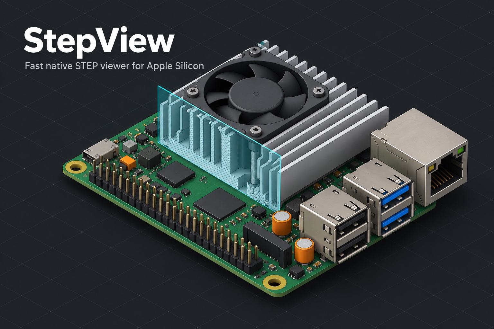

# stepview



Fast native viewer for STEP (ISO 10303-21, AP203 / AP214 / AP242) files on macOS / Apple Silicon.
Pure Rust: its own Part 21 parser, its own B-rep tessellator, Metal rendering through wgpu, egui UI.
No OpenCASCADE.

Measured on an M1 Max with a 74 MB Creo AP203 assembly of a carrier board (1.39 M entities,
31,694 faces, 1,285 part instances):

| stage | time |
|---|---|
| index the file (parallel) | ~20 ms |
| product structure + colours | ~50 ms |
| B-rep extraction + tessellation (~750k triangles drawn) | ~400 ms |
| headless 1600×1200 render | ~30 ms |
| warm re-open (mesh cache hit) | ~70 ms |

## Use

```
stepview <file.step>                    # open the GUI (also: drag & drop, ⌘O, Finder "Open With")
stepview info <file> [--tree] [--mesh] [--types] [--json] [--dump '#123']
stepview render <file> -o out.png [--size 1600x1200] [--view iso|top|front|right|back|left|bottom|yaw,pitch] [--bg '#rrggbb'] [--only <node name>]
stepview export <file> -o out.{glb|gltf|stl|obj} [--flatten] [--ascii]
stepview bench <file> [--iters 5] [--stage index|structure|extract|tess|all]
stepview cache info|clear|prune
```

Global flags: `--tol <mm>` (chord tolerance; default derives from model size), `--no-cache`, `--no-colors`.

### GUI

| input | action |
|---|---|
| drag | orbit (turntable, Z up) |
| ⇧ drag / middle drag / right drag | pan |
| scroll or pinch | zoom to cursor (⇧ scroll pans) |
| rotate gesture | roll |
| click / double-click | select face / fit to part |
| F · 1–7 | fit all · front, back, left, right, top, bottom, iso |
| S · W · X | shaded+edges · wireframe · x-ray |
| H · ⇧H · I | hide selected · show all · isolate |
| ⌘O · ⌘E · ⌘S · ⌘R | open · export · screenshot (2×) · reload |

Panels: assembly tree (filter, show/hide checkboxes, right-click for fit / hide / isolate), properties
(selected part path, shape, face `#id`, surface type, colour, normal, size), measure (two picked
points → distance and ΔXYZ), section plane (X/Y/Z or the last picked face's normal, offset slider,
flip), model statistics and load diagnostics. Preferences (display mode, quality, colours, recent
files) persist between runs.

## Build and install

```
cargo build --release              # target/release/stepview
cargo test --workspace --release   # unit + fixture tests (root fixtures are skipped if absent)
macos/build.sh --install           # StepView.app (ad-hoc signed) → /Applications, registers .step/.stp
```

`macos/build.sh` needs `cargo-packager` (`cargo install cargo-packager --version 0.11.8 --locked`).
The app registers the UTI `com.dresden.stepview.step` for `.step`, `.stp`, `.p21` and also claims the
third-party UTIs that own those extensions on a stock Mac, so it appears in Finder's "Open With". Files
opened from Finder arrive through `application:openURLs:` (see `src/macos/`).

Quick Look: `macos/build.sh` also builds two app extensions from `macos/QuickLook/` with `swiftc` (no
Xcode project) and embeds them in the bundle: a thumbnail provider (Finder icons, rendered by the Rust
core through `crates/step-ffi`, reusing the app's mesh cache when warm, degrading to a bounding-box
silhouette if it would exceed its ~0.9 s budget) and a Space-bar preview (SceneKit view built from the
same tessellation). After `--install`, launch StepView once so Launch Services registers the
extensions; `pluginkit -m -v -i com.dresden.stepview.thumbnail` should then list it. Note that
`qlmanage -t/-p` may hang for extension-backed types on recent macOS; test in Finder instead.
Set `STEPVIEW_NO_QL=1` to skip building the extensions.

## How it works

```
step-p21    mmap + parallel chunked entity index (12 B/entity), lazy zero-copy attribute cursor
step-model  typed decoders → geometry in mm (per representation context: files mix inch and mm)
step-brep   product structure (ownership-based transforms), colours, topology arena (shared edges)
step-mesh   per-face tessellation in (u,v): edge polylines shared between faces (crack-free),
            analytic inverses for planes/cylinders/cones/spheres/tori, Newton for NURBS, seam
            unwrapping, constrained Delaunay (spade) with Steiner points, fallbacks, never panics
step-cache  content-addressed mesh cache in ~/Library/Caches/stepview/v1
step-render wgpu (Metal) shaded / edge / ID passes, f64 camera, GPU picking, offscreen PNG
step-export STL, OBJ (+MTL), glTF/GLB (hierarchy + instancing + vertex colours)
step-ffi    C ABI for the Quick Look extensions
stepview    CLI + eframe GUI, progressive background loader
```

Everything is converted to millimetres at decode time. Faces that cannot be meshed become
diagnostics (see `stepview info --mesh`), never a failed load.
